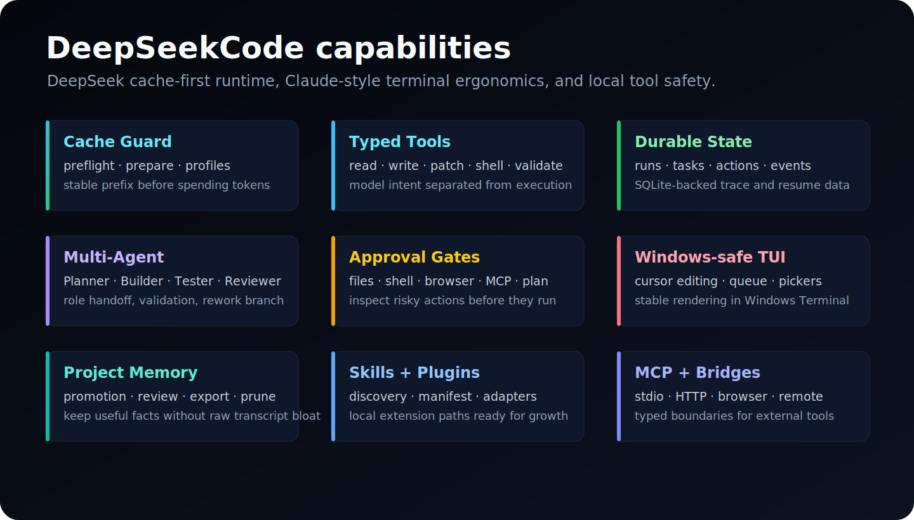

<p align="center">
  
</p>

<p align="center">
  <a href="./README.md">English</a>
  &nbsp;·&nbsp;
  <a href="./README.zh-CN.md">简体中文</a>
  &nbsp;·&nbsp;
  <strong>日本語</strong>
  &nbsp;·&nbsp;
  <a href="https://xh20010913-svg.github.io/DeepSeekCode/">Website</a>
  &nbsp;·&nbsp;
  <a href="./docs/WEBSITE_GUIDE.md">Guide</a>
  &nbsp;·&nbsp;
  <a href="./docs/ARCHITECTURE.md">Architecture</a>
  &nbsp;·&nbsp;
  <a href="./docs/CLI_REFERENCE.md">CLI</a>
</p>

<p align="center">
  <a href="https://github.com/xh20010913-svg/DeepSeekCode"></a>
  <a href="./LICENSE"></a>
  <a href="./package.json">= 22"/></a>
  <a href="./package.json"></a>
  <a href="https://platform.deepseek.com"></a>
</p>

<br/>

<h3 align="center">DeepSeek-first のローカル coding agent。</h3>
<p align="center">DeepSeekCode は DeepSeek の prefix cache、TypeScript runtime、durable state、明示的な local tools を中心に設計したプロジェクトです。</p>

<br/>

<p align="center">
  
</p>

<br/>

> [!TIP]
> DeepSeekCode では cache hit rate を UI の飾りではなく runtime の設計制約として扱います。安定した rules、tool schema、project memory、repository map、cache pins を前方に固定し、変動しやすい user turn と tool feedback は後方に置きます。

<br/>

## Install

Node.js >= 22 が必要です。Windows Terminal / PowerShell、macOS、Linux で動作します。

```bash
git clone https://github.com/xh20010913-svg/DeepSeekCode.git
cd DeepSeekCode
npm install
npm run build
```

DeepSeek をローカルで設定します。

```bash
DEEPSEEK_BASE_URL=https://api.deepseek.com
DEEPSEEK_API_KEY=your_deepseek_api_key
DEEPSEEK_MODEL=deepseek-v4-flash
```

任意の project directory に対して起動します。

```bash
npm run start -- --project "D:\code\DeepSeekTest"
```

開発と検証:

```bash
npm run dev -- --project "D:\code\DeepSeekTest"
npm run doctor
npm run smoke
npm run parity
```

<br/>

## Core Ideas

| Pillar | What it means |
| --- | --- |
| Cache-first loop | Stable prompt prefix, cache guard, cache pins, reusable profiles, and provider cache telemetry. |
| Typed local actions | The model proposes an action envelope; DeepSeekCode validates path, permission, tool, and artifact state before execution. |
| Durable work | Runs, tasks, events, approvals, memory, usage, and traces are persisted instead of living only in terminal memory. |

詳細は [Architecture](./docs/ARCHITECTURE.md) と [Website Guide](./docs/WEBSITE_GUIDE.md) を参照してください。

<br/>

## Capabilities

<p align="center">
  
</p>

<br/>

## Commands

```text
/help
/doctor
/status
/config
/cache
/cache guard <goal>
/cache prepare <goal>
/model verify
/shell on|off
/browser on|off
/cmd <command>
/diff git
/approval list
/plan start|show|approve|reject|cancel
/memory list|accepted|export
/skills
/plugins
/mcp
/multi provider <task>
/quit
```

<br/>

## Documentation

- [Website Guide](./docs/WEBSITE_GUIDE.md)
- [Architecture](./docs/ARCHITECTURE.md)
- [CLI Reference](./docs/CLI_REFERENCE.md)
- [Technical Architecture](./docs/TECHNICAL_ARCHITECTURE.md)
- [Architecture Parity Status](./docs/CLAUDE_CODE_PARITY_STATUS.md)

<br/>

---

<p align="center">
  <sub>MIT · see <a href="./LICENSE">LICENSE</a></sub>
  <br/>
  <sub>Built for DeepSeek-first local coding at <a href="https://github.com/xh20010913-svg/DeepSeekCode">xh20010913-svg/DeepSeekCode</a></sub>
</p>
