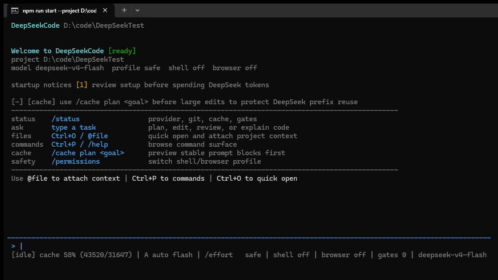

<p align="center">
  
</p>

<p align="center">
  <a href="./README.md">English</a>
  &nbsp;|&nbsp;
  <a href="./README.zh-CN.md">简体中文</a>
  &nbsp;|&nbsp;
  <strong>日本語</strong>
  &nbsp;|&nbsp;
  <a href="https://xh20010913-svg.github.io/DeepSeekCode/">Website</a>
  &nbsp;|&nbsp;
  <a href="./GUIDE.md">Guide</a>
  &nbsp;|&nbsp;
  <a href="./ARCHITECTURE.md">Architecture</a>
  &nbsp;|&nbsp;
  <a href="./CLI_REFERENCE.md">CLI</a>
</p>

<p align="center">
  <a href="https://github.com/xh20010913-svg/DeepSeekCode"></a>
  <a href="./LICENSE"></a>
  <a href="./package.json">= 22"/></a>
  <a href="./package.json"></a>
  <a href="https://platform.deepseek.com"></a>
</p>

<h3 align="center">DeepSeek-first のローカル coding agent。</h3>

<p align="center">
  
</p>

DeepSeekCode は TypeScript 製のローカル Agent ランタイムです。安定した system rules、tool schema、project memory、repository facts、cache pins を prompt の前方に置き、ユーザー入力と圧縮済み tool feedback を後方に置くことで、DeepSeek の prefix cache 再利用を狙います。

## Highlights

- Local typed tools for file editing, patching, shell, browser, Office artifacts, MCP, skills, and validation.
- Durable SQLite state for runs, actions, artifacts, tasks, approvals, validations, usage, and cache telemetry.
- Session restore with `--continue` and `--resume <session-id>` after restarting the CLI.
- Compact `tool_result_summary` persistence to avoid replaying long stdout, diffs, and logs.
- `runtime_run_state` summaries for continuing paused work across processes.
- Multi-agent Planner -> Builder -> Tester -> Reviewer flow with compact feedback and checkpoints.

## Install

Node.js >= 22 is required.

```bash
git clone https://github.com/xh20010913-svg/DeepSeekCode.git
cd DeepSeekCode
npm install
npm run build
```

Configure DeepSeek:

```bash
DEEPSEEK_BASE_URL=https://api.deepseek.com
DEEPSEEK_API_KEY=your_deepseek_api_key
DEEPSEEK_MODEL=deepseek-v4-flash
```

Start with a separate test project:

```bash
npm run start -- --project "D:\code\DeepSeekTest"
```

Continue the latest session:

```bash
npm run start -- --project "D:\code\DeepSeekTest" --continue -p "Continue the last task"
```

Resume a specific session:

```bash
npm run start -- --project "D:\code\DeepSeekTest" --resume session_xxx -p "Continue the paused work"
```

## Validation

The release tree was checked with:

- `npm run typecheck`
- `npm run build`
- live cross-process session resume tests
- live multi-agent workflow tests

The live prompt audit confirmed that `recent_conversation`, `tool_result_summary`, and `runtime_run_state` are included in provider prompts.

## Commands

| Command | Purpose |
| --- | --- |
| `/doctor` | Check provider, model, paths, and permissions. |
| `/cache` | Inspect cache readiness and prompt shape. |
| `/sessions` / `/resume` | List or focus persisted transcript sessions. |
| `/runs` / `/trace` | Inspect durable run/action/task state. |
| `/multi provider <task>` | Run Planner -> Builder -> Tester -> Reviewer. |

See [CLI Reference](./CLI_REFERENCE.md) for details.

## Links

- [Guide](./GUIDE.md)
- [Architecture](./ARCHITECTURE.md)
- [CLI Reference](./CLI_REFERENCE.md)
- [Website Guide](./website/guide.html)

## License

MIT
