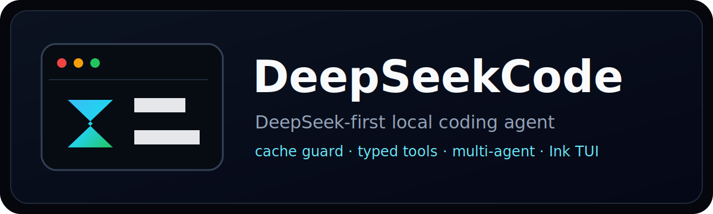

<p align="center">
  
</p>

<p align="center">
  <strong>English</strong>
  &nbsp;|&nbsp;
  <a href="./README.zh-CN.md">简体中文</a>
  &nbsp;|&nbsp;
  <a href="https://xh20010913-svg.github.io/DeepSeekCode/">Website</a>
  &nbsp;|&nbsp;
  <a href="./GUIDE.md">Guide</a>
  &nbsp;|&nbsp;
  <a href="./ARCHITECTURE.md">Architecture</a>
  &nbsp;|&nbsp;
  <a href="./CLI_REFERENCE.md">CLI</a>
  &nbsp;|&nbsp;
  <a href="./DEVELOPMENT.md">Development</a>
  &nbsp;|&nbsp;
  <a href="./API_REFERENCE.md">API</a>
</p>

<p align="center">
  <a href="https://github.com/xh20010913-svg/DeepSeekCode"></a>
  <a href="./LICENSE"></a>
  <a href="./package.json"></a>
  <a href="./package.json">= 22"/></a>
</p>

# DeepSeekCode

DeepSeekCode is a DeepSeek-first local terminal agent runtime for project work, office artifacts, long-running tasks, and recoverable testing. It calls typed local tools through native DeepSeek function calling, persists run/task/action/artifact/usage state in SQLite, and can continue work after CLI restarts.

v0.2.7 documents the current wired capability surface rather than treating partial work as finished. The main loop is:

```text
stable runtime prompt + context
  -> DeepSeek native tool_calls
  -> local typed tools
  -> tool_result messages
  -> next provider turn or final answer
```

There is no model-facing ActionEnvelope JSON planner or JSON fallback. Internal schemas still validate tool arguments, state records, configuration, and reports.

## Runtime Screenshots

These screenshots come from real test windows in `D:\code\DeepSeekTest`: the agent startup screen, a real agent dialogue while it reviews generated artifacts, and the generated web artifact running in a browser. They do not include secrets, prompt audit files, or raw test artifacts.

| Agent startup | Real agent work |
| --- | --- |
|  |  |

Generated artifact running in the browser:


## Quickstart

Requirements:

- Node.js 22 or newer.
- A DeepSeek chat/completions endpoint that supports native tool calls.
- A project directory for DeepSeekCode to inspect and edit.

Install globally, then run `deepseekcode` inside any project directory. The current directory becomes the project, and runtime state is written to that directory's `.deepseekcode` folder.

Official npm registry install:

```bash
npm install -g @xh12312/deepseekcode
cd D:\work\agent-test
deepseekcode
```

If a regional npm mirror returns `404 Not Found` for a fresh release, install from the official registry:

```bash
npm install -g @xh12312/deepseekcode --registry https://registry.npmjs.org/
```

GitHub network install is also supported for testing the current `main` branch:

```bash
npm install -g github:xh20010913-svg/DeepSeekCode
```

You can still pass an explicit project path:

```bash
deepseekcode --project "D:\work\agent-test"
```

The installed command is `deepseekcode`. The package does not install a `deepseek` alias, which avoids collisions with other DeepSeek ecosystem tools.

On Windows PowerShell, if the execution policy blocks npm's generated `deepseekcode.ps1` shim, run `deepseekcode.cmd` from the same PATH entry instead. In cmd, `deepseekcode` works directly.

When the TUI starts and shell is not already enabled, DeepSeekCode asks whether to enable shell execution for this session. Use Up/Down to choose, Enter to confirm, and Esc/N to keep shell off. If enabled, build, test, and validation commands can run in the current project. If kept off, real `run_command` requests still show a permission picker later.

Source checkout:

```bash
git clone https://github.com/xh20010913-svg/DeepSeekCode.git
cd DeepSeekCode
npm install
npm run build
```

Configure:

```bash
DEEPSEEK_BASE_URL=https://api.deepseek.com
DEEPSEEK_API_KEY=your_deepseek_api_key
DEEPSEEK_MODEL=deepseek-v4-flash
DEEPSEEKCODE_LANGUAGE=zh-CN
```

Start from source against a separate working directory:

```bash
npm run start -- --project "D:\work\agent-test"
```

Source-mode development:

```bash
npm run dev -- --project "D:\work\agent-test"
```

Continue after restarting the CLI:

```bash
deepseekcode --project "D:\work\agent-test" --continue -p "Continue the last task"
deepseekcode --project "D:\work\agent-test" --resume session_xxx -p "Continue the paused work"
```

## Model Selection

Use flash for routine testing and pro for harder planning:

```text
/model
/model flash
/model pro
```

The TUI model picker is available from `/model`. The footer shows the active model, token totals, cache hit/miss tokens, and estimated run cost when provider usage is available.

## Core Commands

| Command | Purpose |
| --- | --- |
| `/doctor` | Check provider readiness, native tool calling, paths, skills/plugins, cache, and permissions. |
| `/tools` | List the real local tool registry with verified, permission-required, partial, experimental, or reserved status. |
| `/skills` | List, search, install, update, validate, uninstall, and run skills. |
| `/plugins` | List, install, update, validate, enable/disable, and uninstall plugins. |
| `/model` | Open the model picker or switch with `/model flash` and `/model pro`. |
| `/language zh\|en` | Switch the TUI language. Chinese is the default. |
| `/cache` | Inspect cache readiness, prompt shape, profiles, and guard reports. |
| `/usage` `/cost` | Show persisted token and estimated cost summaries. |
| `/memory status` | Show TencentDB-Agent-Memory status, storage, recall, extraction, and registered memory tools. |
| `/memory search <query>` | Search structured long-term memories. |
| `/memory conversation <query>` | Search raw captured conversation history. |
| `/runs` `/trace` `/events` | Inspect durable runs, actions, tasks, and events. |
| `/runs report latest "D:\work\agent-test"` | Export a scenario report as Markdown and JSON. |
| `/ask <question>` | Ask a read-only side question while a long task keeps running. |
| `/multi provider <task>` | Run the Planner -> Builder -> Tester -> Reviewer workflow. |
| `/agents start\|status\|message\|stop` | Manage agent definitions and workflow state. |
| `/approval` `/validation` | Inspect and resolve approval or validation gates. |
| `/resume` `/sessions` | Restore persisted chat sessions. |
| `/remote-control` | Inspect, start, or stop Enterprise WeChat / personal WeChat remote control. |

See [CLI Reference](./CLI_REFERENCE.md) for the full command surface.

## WeChat Remote Control

v0.2.7 keeps the Enterprise WeChat / WeCom intelligent bot bridge and the experimental personal WeChat OpenClaw channel, and adds remote `/ask`, shared run status, and a clearer artifact preview policy. Both channels are only remote message surfaces; the core agent path remains local `QueryEngine -> native tool_calls -> local tools -> tool_result`.

Enterprise WeChat:

```bash
deepseekcode --wecom --project "D:\work\agent-test" --model deepseek-v4-flash
```

Personal WeChat OpenClaw:

```bash
deepseekcode --wechat-login --project "D:\work\agent-test"
deepseekcode --wechat --project "D:\work\agent-test" --model deepseek-v4-flash
```

Inside the TUI:

```text
/remote-control
/remote-control wecom start
/remote-control wechat login
/remote-control wechat start
/remote-control wechat stop
```

Configuration:

```bash
DEEPSEEKCODE_WECOM_BOT_ID=your_wecom_bot_id
DEEPSEEKCODE_WECOM_BOT_SECRET=your_wecom_bot_secret
DEEPSEEKCODE_WECOM_ALLOWED_USERS=userid1,userid2
DEEPSEEKCODE_WECOM_ALLOWED_GROUPS=chatid1,chatid2
DEEPSEEKCODE_WECOM_PROJECT_ROOTS=D:\work;D:\code\DeepSeekTest
DEEPSEEKCODE_WECHAT_OPENCLAW_ENABLED=true
DEEPSEEKCODE_WECHAT_ALLOWED_USERS=
DEEPSEEKCODE_WECHAT_ALLOWED_GROUPS=
DEEPSEEKCODE_WECHAT_PROJECT_ROOTS=D:\work;D:\code\DeepSeekTest
DEEPSEEKCODE_WECHAT_MENTION_NAMES=DeepSeekCode,deepseekcode
```

Remote text supports `/help`, `/status`, `/ask <question>`, `/project`, `/project <path>`, `/run <task>`, `/continue`, `/stop`, `/artifacts`, and `/usage`. Natural-language tasks also work. When a long task is already running, normal new tasks return the current status; `/ask` answers read-only side questions without interrupting the main run. Group chats require `@DeepSeekCode` or a `/run` prefix by default. Sensitive shell/browser/file actions still go through the local permission gate. WeCom receives approval cards; personal WeChat uses a numeric reply menu: `1` allow once, `2` allow for session, `3` reject, `4` stop.

Artifact delivery is based on actual files rather than prompt keywords. HTML is rendered to a screenshot instead of flooding WeChat with raw HTML/CSS/JS. DOCX/PPTX/PDF files are sent when WeChat can open them. Markdown/text gets a short chat summary by default. Multi-file projects send an entry-point summary, preview image, and manifest-style list.

The personal WeChat path uses Tencent `@tencent-weixin/openclaw-weixin` / OpenClaw QR login and long polling. It is not a PC hook, reverse protocol, or wxauto bridge. Auth state is stored under `.deepseekcode/remote/wechat-openclaw/auth/` and is never sent to the model or committed.

## Capability Matrix

| Area | Status | Notes |
| --- | --- | --- |
| Native DeepSeek tool calls | verified | Required for local work. Unsupported models or gateways fail explicitly. |
| TencentDB-Agent-Memory | verified | Vendored MIT runtime from TencentDB-Agent-Memory. Provides L0 conversation capture, L1 structured memories, L2 scenes, L3 persona, recall injection, and `tdai_memory_search`/`tdai_conversation_search`. Local SQLite is default; TCVDB and embeddings require explicit configuration. |
| File tools | verified | `read_file`, `write_file`, `apply_patch`, `list_files`, `grep_files`; scoped to `--project`. |
| Shell tools | permission-required | Disabled unless the session allows shell. Dangerous Windows commands go through gates. |
| Browser CDP tools | partial | Browser actions are integrated and permission-gated; real UI acceptance still needs more work. |
| WeCom remote control | experimental / testable | Uses the official `@wecom/aibot-node-sdk` long-connection SDK for text tasks, concise progress, approval cards, project binding, attachment inbox, and artifact summaries. |
| Personal WeChat OpenClaw | experimental / testable | Uses Tencent `@tencent-weixin/openclaw-weixin@2.4.4` QR login and long polling for text tasks, numeric approval, project binding, attachment inbox, `/ask`, and artifact preview policy. |
| Personal WeChat hook | reserved | PC hooks, reverse protocols, and wxauto are not wired into the default build. |
| MCP tools | partial | Exposed through `mcp_call`; native per-tool schema expansion is planned. |
| Hooks | verified | PreToolUse and PostToolUse run around local tools; hook errors are recorded without taking over the main task. |
| Skills | verified | Built-in/project/user/plugin skills are discoverable and invokable. `.claude` skills are compatible; installs target `.deepseekcode`. |
| Plugins | verified | Local path, GitHub URL, Git URL, and `file://` Git installs; command, skill, and hook discovery. |
| Multi-agent workflow | experimental / testable | Adds `start_agent_workflow`, `send_agent_message`, `agent_status`, and `finish_agent_workflow` for role specs, blackboard messages, reviewer state, and checkpoints. |
| Side-channel `/ask` | verified | Reads current run, tasks, events, artifacts, and usage; it does not write files or call shell/browser/MCP. |
| RunEventBus / SessionHub | partial | Persisted events publish to a shared event bus and remote channel status enters SessionHub; full TUI/remote co-view is still in progress. |
| DOCX/PPTX | partial | Low-level `create_docx`/`create_pptx` are wired; stronger Office/PPT templates, charts, images, and render checks are still being improved. |
| PDF | experimental | `create_pdf` is reserved/experimental and is not documented as full PDF authoring. |
| Long-running jobs | partial | Runs, tasks, checkpoints, pause/resume/cancel, and multi-agent state are durable; a full background worker pool is still evolving. |
| `computer_use` | reserved | The tool surface is reserved until a real GUI bridge is wired. |
| Prompt audit | debug mode | Off by default; set `DEEPSEEKCODE_PROMPT_AUDIT_DIR` to record provider request bodies. |

## Skills And Plugins

Install skills. A source with one `SKILL.md` installs that skill. A repository with multiple `SKILL.md` files installs all skills when no name is provided:

```text
/skills install "D:\skills\office-report"
/skills install https://github.com/example/agent-skills/tree/main/office/report
/skills install file:///D:/repos/agent-skills.git#main:office/report
/skills install greensock/gsap-skills
/skills install-all greensock/gsap-skills
/skills install greensock/gsap-skills gsap-core
/skills search gsap
/skills update office-report
/skills validate
```

Install a plugin:

```text
/plugins install "D:\plugins\review-kit"
/plugins install https://github.com/example/deepseekcode-plugin
/plugins install file:///D:/repos/deepseekcode-plugin.git#main
/plugins enable review-kit
/plugins validate
```

Plugin and skill installation validates names, manifest shape, BOM handling, and unsafe subpaths. `.claude` skill/plugin directories can be discovered for compatibility; installed copies are written under `.deepseekcode`.

Automatic invocation: DeepSeekCode exposes auto-invokable skill names and `description` values to the agent prompt, and provides native `search_skills` and `invoke_skill` tools. The model decides when to search and invoke a skill from task semantics; there is no hard-coded "website/PPT/GSAP" keyword router. Skills marked with `disable-model-invocation: true` are excluded from automatic candidates but remain available through `/skills run <name> <task>`.

## Long Tasks And Context

DeepSeekCode does not replay every old token forever. It builds layered context:

- Stable runtime prompt and tool definitions stay first for prefix-cache reuse.
- TencentDB-Agent-Memory recalls durable L1/L3 memory before classification and prompt planning.
- Recent conversation keeps the last useful turns.
- Rolling summaries keep older goals, paths, decisions, failures, and remaining work.
- `tool_result_summary` stores compact tool feedback instead of full stdout, long diffs, and logs.
- `runtime_run_state` summarizes runs, task DAGs, artifacts, gates, and checkpoints.

Use `/cache`, `/usage`, `/cost`, `/runs`, and `/trace` to inspect how a long task is behaving.

## Long-Term Memory

DeepSeekCode includes a vendored MIT build of [TencentDB-Agent-Memory](https://github.com/TencentCloud/TencentDB-Agent-Memory). It is wired into the DeepSeekCode runtime instead of installed as an OpenClaw plugin:

- Before each provider turn, DeepSeekCode runs TDAI recall and injects relevant memories into dynamic context.
- After a successful turn, DeepSeekCode captures user/assistant messages into TDAI L0 and lets the TDAI pipeline extract L1/L2/L3 memory.
- The model can call `tdai_memory_search` and `tdai_conversation_search` through native DeepSeek tool calling.
- Data is stored under the runtime data directory, for example `.deepseekcode/tdai/memory-tdai/`.
- Embedding and Tencent Cloud VectorDB are optional. Without embedding config, local SQLite/FTS and JSONL capture still work; semantic vector recall is not advertised as enabled.

Useful commands:

```text
/memory status
/memory search language preference
/memory conversation "continue the dashboard"
```

Configuration switches:

```bash
DEEPSEEKCODE_TDAI_MEMORY=on
DEEPSEEKCODE_TDAI_CAPTURE=true
DEEPSEEKCODE_TDAI_RECALL=true
DEEPSEEKCODE_TDAI_EXTRACTION=true
DEEPSEEKCODE_TDAI_STORE=sqlite
```

## Real Scenario Testing

Real tests should run outside the source repo, for example in `D:\work\agent-test`.

Recommended scenarios:

- Build a large single-page website, then continue improving it across multiple turns.
- Create a thesis defense PPT, a course PPT, and an OFDR principles PPT with diagrams and verification.
- Create a DOCX project report.
- Trigger a failure, then ask the agent to diagnose and repair it.
- Run a Planner/Builder/Tester/Reviewer multi-agent task.
- Validate a webpage through browser tools when browser permission is enabled.

Enable prompt audit only for testing:

```bash
set DEEPSEEKCODE_PROMPT_AUDIT_DIR=D:\work\agent-test\prompt-audit
deepseekcode --project "D:\work\agent-test" --permission-profile dev
```

Export a report:

```text
/runs report latest "D:\work\agent-test"
```

Reports include model, token usage, cache hit/miss, tool counts, artifacts, failures, and recommendations.

## Still In Progress

v0.2.7 adds multi-agent workflow, side-channel `/ask`, RunEventBus/SessionHub, and clearer WeChat status/artifact delivery. It does not claim the entire 24-item backend plan is finished. Work that remains active:

- Full realistic scenario evaluation and self-repair coverage.
- Background worker pool details for long tasks, queue recovery, cancel, retry, and resume.
- Office/PPT quality: templates, charts, images, and render validation.
- TUI keyboard/mouse acceptance: transcript scroll, history input, pickers, and permission dialogs.
- Browser CDP and GUI automation boundaries.
- Model selection, token, cost, and cache telemetry polish in the UI.
- Full desktop TUI and WeChat/WeCom co-view synchronization.

## Architecture

Read [Architecture](./ARCHITECTURE.md) for the native tool loop, provider behavior, context/cache model, long-running state, multi-agent flow, MCP/hooks, and release boundaries. See [Development Guide](./DEVELOPMENT.md) for implementation workflow and [API Reference](./API_REFERENCE.md) for CLI, remote, tool, and workflow interfaces.

## Build Checks

```bash
npm run typecheck
npm run build
```

The repository also includes GitHub Actions CI for typecheck and build, plus GitHub Pages deployment for `website/`. v0.2.7 keeps the build helper present in the published repository.

## Release Boundary

The published tree contains runtime source, public assets, website, README files, and user-facing manuals. Test output, prompt audits, `.env`, `node_modules`, runtime databases, handoff notes, and development drafts are not part of the release.

## License

MIT

