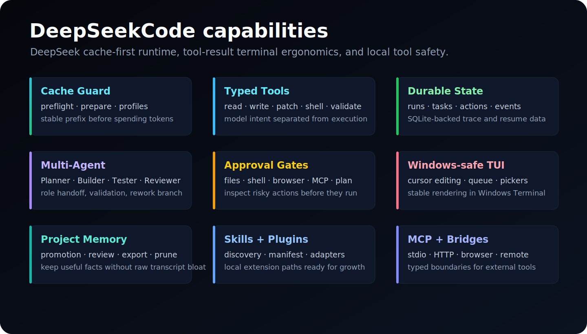

<p align="center">
  
</p>

<p align="center">
  <strong>English</strong>
  &nbsp;·&nbsp;
  <a href="./README.zh-CN.md">简体中文</a>
  &nbsp;·&nbsp;
  <a href="./README.ja-JP.md">日本語</a>
  &nbsp;·&nbsp;
  <a href="https://xh20010913-svg.github.io/DeepSeekCode/">Website</a>
  &nbsp;·&nbsp;
  <a href="./GUIDE.md">Guide</a>
  &nbsp;·&nbsp;
  <a href="./ARCHITECTURE.md">Architecture</a>
  &nbsp;·&nbsp;
  <a href="./CLI_REFERENCE.md">CLI</a>
</p>

<p align="center">
  <a href="https://github.com/xh20010913-svg/DeepSeekCode"></a>
  <a href="./LICENSE"></a>
  <a href="./package.json">= 22"/></a>
  <a href="./package.json"></a>
  <a href="https://platform.deepseek.com"></a>
  <a href="./ARCHITECTURE.md#pillar-1-cache-first-loop"></a>
</p>

<br/>

<h3 align="center">A DeepSeek-first coding agent for terminal work, long-running tasks, and local tools.</h3>
<p align="center">DeepSeekCode is built around DeepSeek cache stability, TypeScript modules, durable state, and explicit local tool execution.</p>

<br/>

<p align="center">
  
</p>

<br/>

> [!TIP]
> DeepSeekCode treats prefix-cache stability as a runtime invariant: stable rules, tool schemas, project memory, repository maps, and cache pins stay early and deterministic; volatile user text and tool feedback stay late.

> [!IMPORTANT]
> DeepSeekCode keeps DeepSeek-specific cache guard, action envelopes, approval gates, Windows-safe TUI editing, and project memory as first-class product surfaces.

<br/>

## Install

Requires Node.js >= 22. Works on Windows Terminal / PowerShell, macOS, and Linux.

```bash
git clone https://github.com/xh20010913-svg/DeepSeekCode.git
cd DeepSeekCode
npm install
npm run build
```

Configure DeepSeek locally:

```bash
DEEPSEEK_BASE_URL=https://api.deepseek.com
DEEPSEEK_API_KEY=your_deepseek_api_key
DEEPSEEK_MODEL=deepseek-v4-flash
```

Start the workbench against any project directory:

```bash
npm run start -- --project "D:\code\DeepSeekTest"
```

Local development and checks:

```bash
npm run dev -- --project "D:\code\DeepSeekTest"
npm run doctor
npm run typecheck
npm run build
```

| Command | When |
| --- | --- |
| `npm run start -- --project <dir>` | Launch the Ink/React terminal agent. |
| `npm run dev -- --project <dir>` | Run directly from TypeScript while developing. |
| `npm run doctor` | Check Node, project path, provider profile, permissions, and state path. |
| `npm run typecheck` | Check the TypeScript program without writing build output. |
| `npm run build` | Compile the runtime into `dist/`. |

<details>
<summary><strong>Slash commands, project scope, and safe defaults</strong></summary>

DeepSeekCode scopes file tools to the project directory you launch with `--project`. Shell and browser actions are disabled by default and must be enabled explicitly.

```text
/help
/doctor
/status
/config
/cache
/cache guard <goal>
/cache prepare <goal>
/cache profile save <name> <goal>
/model verify
/shell on|off
/browser on|off
/cmd <command>
/diff git
/approval list
/plan start|show|approve|reject|cancel
/memory list|accepted|export
/skills
/plugins
/mcp
/multi provider <task>
/quit
```

See [CLI Reference](./CLI_REFERENCE.md) for flags, environment variables, permission profiles, and the public command surface.

</details>

<br/>

## Configuration

DeepSeekCode reads runtime configuration from environment variables and project config files.

| Topic | Quick read |
| --- | --- |
| DeepSeek provider | `DEEPSEEK_BASE_URL`, `DEEPSEEK_API_KEY`, `DEEPSEEK_MODEL`; live provider checks should stay on `deepseek-v4-flash` unless you choose otherwise. |
| Cache guard | `/cache guard`, `/cache prepare`, `/cache profile`, and `.deepseekcode/cache-guard.json` keep prompt shape reusable before large tasks. |
| Tools | Filesystem, patch, shell, browser-open, validation, diff, approval, memory, skills, plugins, and MCP adapters are separated behind typed tool boundaries. |
| Permissions | Shell/browser are off by default; approval gates make file edits, commands, browser actions, MCP calls, and plan decisions inspectable. |
| State | Runs, tasks, actions, events, artifacts, usage, memory, approvals, and prompt-cache telemetry are durable instead of UI-only. |
| Guide | [Guide](./GUIDE.md) covers setup, first run, project scope, permissions, cache workflow, and release checks. |
| Website | [Website Guide](./website/guide.html) explains the static site, pages, screenshots, and GitHub Pages deployment shape. |

<br/>

## What Makes DeepSeekCode Different

DeepSeekCode is organized around three pillars:

1. **Cache-first loop**: stable prefix blocks, content-free shape tracking, pin suggestions, preflight/guard/prepare commands, and provider-reported cache hit/miss accounting.
2. **Typed local action runtime**: the model proposes a structured action envelope; DeepSeekCode validates paths, permissions, tools, and artifacts before touching disk or shell.
3. **Durable long-running work**: runs, task DAGs, Planner/Builder/Tester/Reviewer roles, rework branches, approval gates, memory promotions, and trace rows survive beyond one terminal redraw.

Read the full [Architecture](./ARCHITECTURE.md) guide for the runtime shape, state model, tool boundaries, and extension points.

<br/>

## Capabilities

<p align="center">
  
</p>

<br/>

## How It Compares

| Area | DeepSeekCode | Terminal SaaS tools | IDE agents | Patch-first CLIs |
| --- | --- | --- | --- | --- |
| Primary provider | DeepSeek-first | mixed | mixed | many providers |
| UI | Ink/React terminal workbench | web or desktop | IDE panel | CLI |
| Cache strategy | Cache guard, pins, profiles, telemetry, prompt-shape tracking | hidden or provider-dependent | hidden or provider-dependent | provider-dependent |
| Local tools | Typed action envelope + approval gates | workspace integrations | IDE integrations | Git/file edit loop |
| Multi-agent | Planner -> Builder -> Tester -> Reviewer with durable tasks | workflow automation | agent tabs/tasks | limited |
| Extensibility | Skills, plugins, MCP, hooks, bridge directories | marketplace-oriented | extension-oriented | scripting/config |
| Project state | SQLite runs/tasks/actions/events/memory | cloud or workspace state | IDE state | repository diff |

The goal is not to impersonate any one tool. The goal is a DeepSeek-native local coding agent that can keep working cheaply and safely over long sessions.

<br/>

## Release Links

- [Website](https://xh20010913-svg.github.io/DeepSeekCode/)
- [Guide](./GUIDE.md)
- [Architecture](./ARCHITECTURE.md)
- [CLI Reference](./CLI_REFERENCE.md)
- [Website Guide](./website/guide.html)
- [Install](#install)
- [Configuration](#configuration)
- [Capabilities](#capabilities)

<br/>

## Community

Issues, discussions, screenshots, and usage reports are welcome at [xh20010913-svg/DeepSeekCode](https://github.com/xh20010913-svg/DeepSeekCode). Good first contributions should start with UI polish, docs, cache telemetry checks, command panels, Windows terminal behavior, and safe tool adapters.

Please include verification output such as `npm run typecheck`, `npm run build`, or the exact live `deepseek-v4-flash` provider check you ran when opening issues or pull requests.

<br/>

## Star History

<a href="https://www.star-history.com/?repos=xh20010913-svg%2FDeepSeekCode&type=date&legend=top-left">
 <picture>
   <source media="(prefers-color-scheme: dark)" srcset="https://api.star-history.com/chart?repos=xh20010913-svg/DeepSeekCode&type=date&theme=dark&legend=top-left" />
   <source media="(prefers-color-scheme: light)" srcset="https://api.star-history.com/chart?repos=xh20010913-svg/DeepSeekCode&type=date&legend=top-left" />
   
 </picture>
</a>

<br/>

## Acknowledgments

DeepSeekCode is shaped by public work on terminal coding agents, DeepSeek cache-first runtimes, MCP, typed tools, and local approval flows. The public code, naming, docs, and product behavior follow the DeepSeekCode design.

<br/>

---

<p align="center">
  <sub>MIT · see <a href="./LICENSE">LICENSE</a></sub>
  <br/>
  <sub>Built for DeepSeek-first local coding at <a href="https://github.com/xh20010913-svg/DeepSeekCode">xh20010913-svg/DeepSeekCode</a></sub>
</p>
