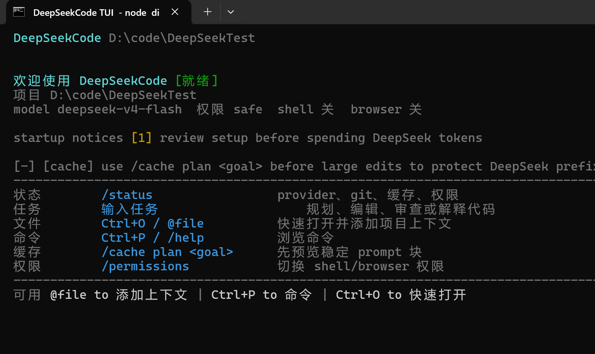
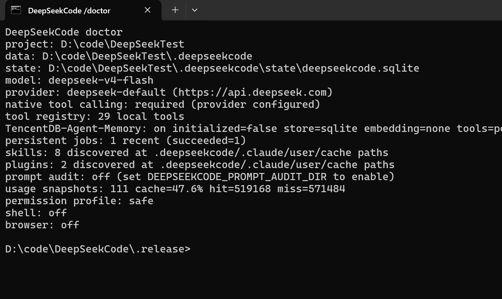
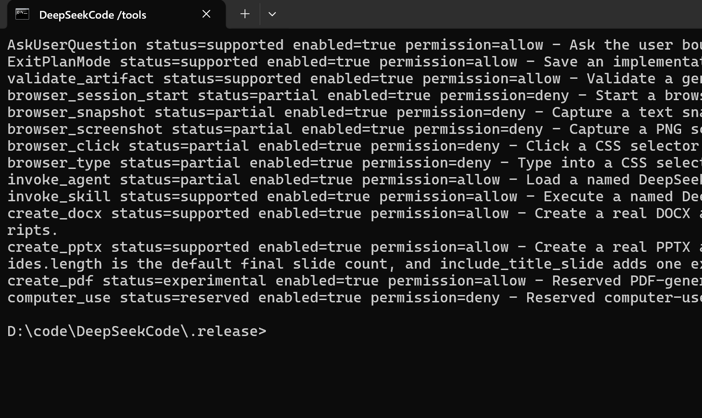
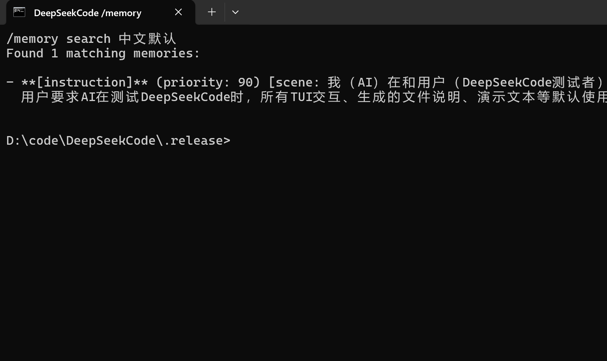
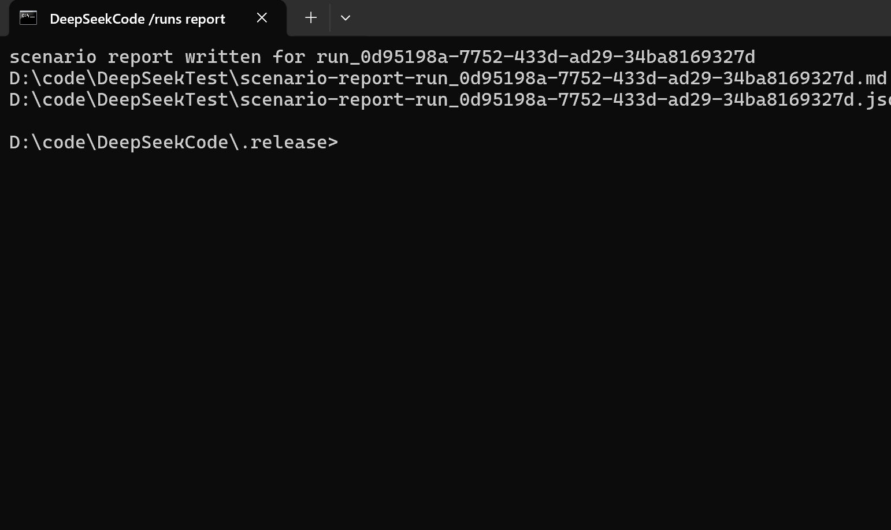
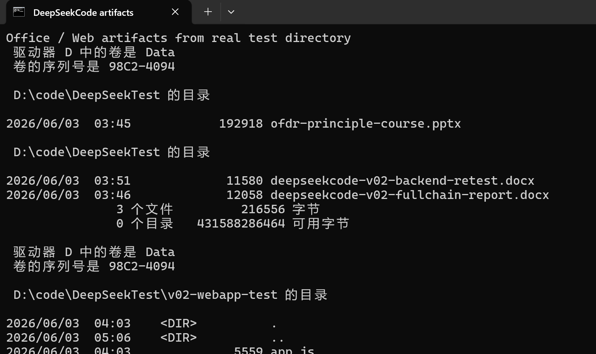

<p align="center">
  
</p>

<p align="center">
  <strong>English</strong>
  &nbsp;|&nbsp;
  <a href="./README.zh-CN.md">简体中文</a>
  &nbsp;|&nbsp;
  <a href="https://xh20010913-svg.github.io/DeepSeekCode/">Website</a>
  &nbsp;|&nbsp;
  <a href="./GUIDE.md">Guide</a>
  &nbsp;|&nbsp;
  <a href="./ARCHITECTURE.md">Architecture</a>
  &nbsp;|&nbsp;
  <a href="./CLI_REFERENCE.md">CLI</a>
</p>

<p align="center">
  <a href="https://github.com/xh20010913-svg/DeepSeekCode"></a>
  <a href="./LICENSE"></a>
  <a href="./package.json"></a>
  <a href="./package.json">= 22"/></a>
</p>

# DeepSeekCode

DeepSeekCode is a DeepSeek-first local terminal agent runtime for project work, office artifacts, long-running tasks, and recoverable testing. It calls typed local tools through native DeepSeek function calling, persists run/task/action/artifact/usage state in SQLite, and can continue work after CLI restarts.

v0.2.1 documents the current wired capability surface rather than treating partial work as finished. The main loop is:

```text
stable runtime prompt + context
  -> DeepSeek native tool_calls
  -> local typed tools
  -> tool_result messages
  -> next provider turn or final answer
```

There is no model-facing ActionEnvelope JSON planner or JSON fallback. Internal schemas still validate tool arguments, state records, configuration, and reports.

<p align="center">
  
</p>

## Runtime Screenshots

These assets are captured from real terminal windows running against `D:\code\DeepSeekTest`. The repository stores only the screenshots under `assets/`, not secrets, prompt audit files, or raw test artifacts.

| Chinese TUI overview | `/doctor` |
| --- | --- |
|  |  |

| `/tools` | `/memory search 中文默认` |
| --- | --- |
|  |  |

| `/runs report` | Office/Web artifact summary |
| --- | --- |
|  |  |

## Quickstart

Requirements:

- Node.js 22 or newer.
- A DeepSeek chat/completions endpoint that supports native tool calls.
- A project directory for DeepSeekCode to inspect and edit.

Install:

```bash
git clone https://github.com/xh20010913-svg/DeepSeekCode.git
cd DeepSeekCode
npm install
npm run build
```

Configure:

```bash
DEEPSEEK_BASE_URL=https://api.deepseek.com
DEEPSEEK_API_KEY=your_deepseek_api_key
DEEPSEEK_MODEL=deepseek-v4-flash
DEEPSEEKCODE_LANGUAGE=zh-CN
```

Start against a separate working directory:

```bash
npm run start -- --project "D:\work\agent-test"
```

Source-mode development:

```bash
npm run dev -- --project "D:\work\agent-test"
```

Continue after restarting the CLI:

```bash
npm run start -- --project "D:\work\agent-test" --continue -p "Continue the last task"
npm run start -- --project "D:\work\agent-test" --resume session_xxx -p "Continue the paused work"
```

## Model Selection

Use flash for routine testing and pro for harder planning:

```text
/model
/model flash
/model pro
```

The TUI model picker is available from `/model`. The footer shows the active model, token totals, cache hit/miss tokens, and estimated run cost when provider usage is available.

## Core Commands

| Command | Purpose |
| --- | --- |
| `/doctor` | Check provider readiness, native tool calling, paths, skills/plugins, cache, and permissions. |
| `/tools` | List the real local tool registry with verified, permission-required, partial, experimental, or reserved status. |
| `/skills` | List, search, install, update, validate, uninstall, and run skills. |
| `/plugins` | List, install, update, validate, enable/disable, and uninstall plugins. |
| `/model` | Open the model picker or switch with `/model flash` and `/model pro`. |
| `/language zh\|en` | Switch the TUI language. Chinese is the default. |
| `/cache` | Inspect cache readiness, prompt shape, profiles, and guard reports. |
| `/usage` `/cost` | Show persisted token and estimated cost summaries. |
| `/memory status` | Show TencentDB-Agent-Memory status, storage, recall, extraction, and registered memory tools. |
| `/memory search <query>` | Search structured long-term memories. |
| `/memory conversation <query>` | Search raw captured conversation history. |
| `/runs` `/trace` `/events` | Inspect durable runs, actions, tasks, and events. |
| `/runs report latest "D:\work\agent-test"` | Export a scenario report as Markdown and JSON. |
| `/multi provider <task>` | Run the Planner -> Builder -> Tester -> Reviewer workflow. |
| `/approval` `/validation` | Inspect and resolve approval or validation gates. |
| `/resume` `/sessions` | Restore persisted chat sessions. |

See [CLI Reference](./CLI_REFERENCE.md) for the full command surface.

## Capability Matrix

| Area | Status | Notes |
| --- | --- | --- |
| Native DeepSeek tool calls | verified | Required for local work. Unsupported models or gateways fail explicitly. |
| TencentDB-Agent-Memory | verified | Vendored MIT runtime from TencentDB-Agent-Memory. Provides L0 conversation capture, L1 structured memories, L2 scenes, L3 persona, recall injection, and `tdai_memory_search`/`tdai_conversation_search`. Local SQLite is default; TCVDB and embeddings require explicit configuration. |
| File tools | verified | `read_file`, `write_file`, `apply_patch`, `list_files`, `grep_files`; scoped to `--project`. |
| Shell tools | permission-required | Disabled unless the session allows shell. Dangerous Windows commands go through gates. |
| Browser CDP tools | partial | Browser actions are integrated and permission-gated; real UI acceptance still needs more work. |
| MCP tools | partial | Exposed through `mcp_call`; native per-tool schema expansion is planned. |
| Hooks | verified | PreToolUse and PostToolUse run around local tools; hook errors are recorded without taking over the main task. |
| Skills | verified | Built-in/project/user/plugin skills are discoverable and invokable. `.claude` skills are compatible; installs target `.deepseekcode`. |
| Plugins | verified | Local path, GitHub URL, Git URL, and `file://` Git installs; command, skill, and hook discovery. |
| DOCX/PPTX | partial | Low-level `create_docx`/`create_pptx` are wired; stronger Office/PPT templates, charts, images, and render checks are still being improved. |
| PDF | experimental | `create_pdf` is reserved/experimental and is not documented as full PDF authoring. |
| Long-running jobs | partial | Runs, tasks, checkpoints, pause/resume/cancel, and multi-agent state are durable; a full background worker pool is still evolving. |
| `computer_use` | reserved | The tool surface is reserved until a real GUI bridge is wired. |
| Prompt audit | debug mode | Off by default; set `DEEPSEEKCODE_PROMPT_AUDIT_DIR` to record provider request bodies. |

## Skills And Plugins

Install a skill:

```text
/skills install "D:\skills\office-report"
/skills install https://github.com/example/agent-skills/tree/main/office/report
/skills install file:///D:/repos/agent-skills.git#main:office/report
/skills update office-report
/skills validate
```

Install a plugin:

```text
/plugins install "D:\plugins\review-kit"
/plugins install https://github.com/example/deepseekcode-plugin
/plugins install file:///D:/repos/deepseekcode-plugin.git#main
/plugins enable review-kit
/plugins validate
```

Plugin and skill installation validates names, manifest shape, BOM handling, and unsafe subpaths. `.claude` skill/plugin directories can be discovered for compatibility; installed copies are written under `.deepseekcode`.

## Long Tasks And Context

DeepSeekCode does not replay every old token forever. It builds layered context:

- Stable runtime prompt and tool definitions stay first for prefix-cache reuse.
- TencentDB-Agent-Memory recalls durable L1/L3 memory before classification and prompt planning.
- Recent conversation keeps the last useful turns.
- Rolling summaries keep older goals, paths, decisions, failures, and remaining work.
- `tool_result_summary` stores compact tool feedback instead of full stdout, long diffs, and logs.
- `runtime_run_state` summarizes runs, task DAGs, artifacts, gates, and checkpoints.

Use `/cache`, `/usage`, `/cost`, `/runs`, and `/trace` to inspect how a long task is behaving.

## Long-Term Memory

DeepSeekCode includes a vendored MIT build of [TencentDB-Agent-Memory](https://github.com/TencentCloud/TencentDB-Agent-Memory). It is wired into the DeepSeekCode runtime instead of installed as an OpenClaw plugin:

- Before each provider turn, DeepSeekCode runs TDAI recall and injects relevant memories into dynamic context.
- After a successful turn, DeepSeekCode captures user/assistant messages into TDAI L0 and lets the TDAI pipeline extract L1/L2/L3 memory.
- The model can call `tdai_memory_search` and `tdai_conversation_search` through native DeepSeek tool calling.
- Data is stored under the runtime data directory, for example `.deepseekcode/tdai/memory-tdai/`.
- Embedding and Tencent Cloud VectorDB are optional. Without embedding config, local SQLite/FTS and JSONL capture still work; semantic vector recall is not advertised as enabled.

Useful commands:

```text
/memory status
/memory search language preference
/memory conversation "continue the dashboard"
```

Configuration switches:

```bash
DEEPSEEKCODE_TDAI_MEMORY=on
DEEPSEEKCODE_TDAI_CAPTURE=true
DEEPSEEKCODE_TDAI_RECALL=true
DEEPSEEKCODE_TDAI_EXTRACTION=true
DEEPSEEKCODE_TDAI_STORE=sqlite
```

## Real Scenario Testing

Real tests should run outside the source repo, for example in `D:\work\agent-test`.

Recommended scenarios:

- Build a large single-page website, then continue improving it across multiple turns.
- Create a thesis defense PPT, a course PPT, and an OFDR principles PPT with diagrams and verification.
- Create a DOCX project report.
- Trigger a failure, then ask the agent to diagnose and repair it.
- Run a Planner/Builder/Tester/Reviewer multi-agent task.
- Validate a webpage through browser tools when browser permission is enabled.

Enable prompt audit only for testing:

```bash
set DEEPSEEKCODE_PROMPT_AUDIT_DIR=D:\work\agent-test\prompt-audit
npm run start -- --project "D:\work\agent-test" --permission-profile dev
```

Export a report:

```text
/runs report latest "D:\work\agent-test"
```

Reports include model, token usage, cache hit/miss, tool counts, artifacts, failures, and recommendations.

## Still In Progress

v0.2.1 is a CI and public documentation quality hotfix. It does not claim the entire 24-item backend plan is finished. Work that remains active:

- Full realistic scenario evaluation and self-repair coverage.
- Background worker pool details for long tasks, queue recovery, cancel, retry, and resume.
- Office/PPT quality: templates, charts, images, and render validation.
- TUI keyboard/mouse acceptance: transcript scroll, history input, pickers, and permission dialogs.
- Browser CDP and GUI automation boundaries.
- Model selection, token, cost, and cache telemetry polish in the UI.

## Architecture

Read [Architecture](./ARCHITECTURE.md) for the native tool loop, provider behavior, context/cache model, long-running state, multi-agent flow, MCP/hooks, and release boundaries.

## Build Checks

```bash
npm run typecheck
npm run build
```

The repository also includes GitHub Actions CI for typecheck and build, plus GitHub Pages deployment for `website/`. v0.2.1 fixes the remote CI failure caused by the missing `scripts/copy-vendor.mjs` build script.

## Release Boundary

The published tree contains runtime source, public assets, website, README files, and user-facing manuals. Test output, prompt audits, `.env`, `node_modules`, runtime databases, handoff notes, and development drafts are not part of the release.

## License

MIT

