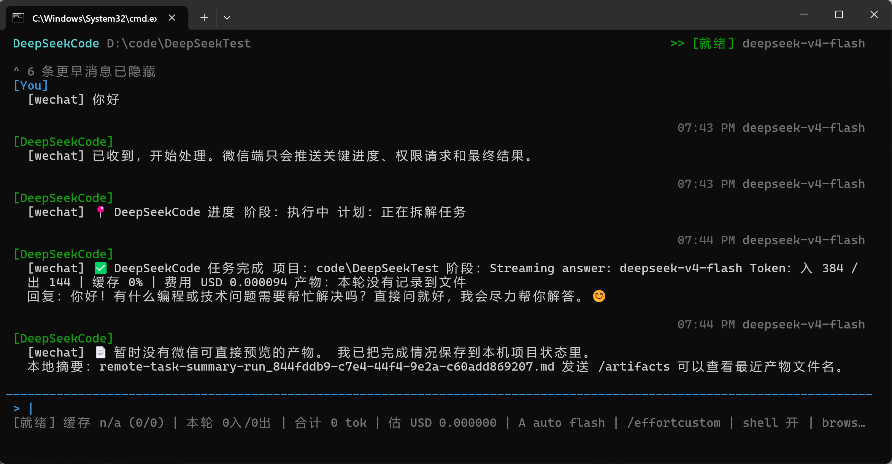
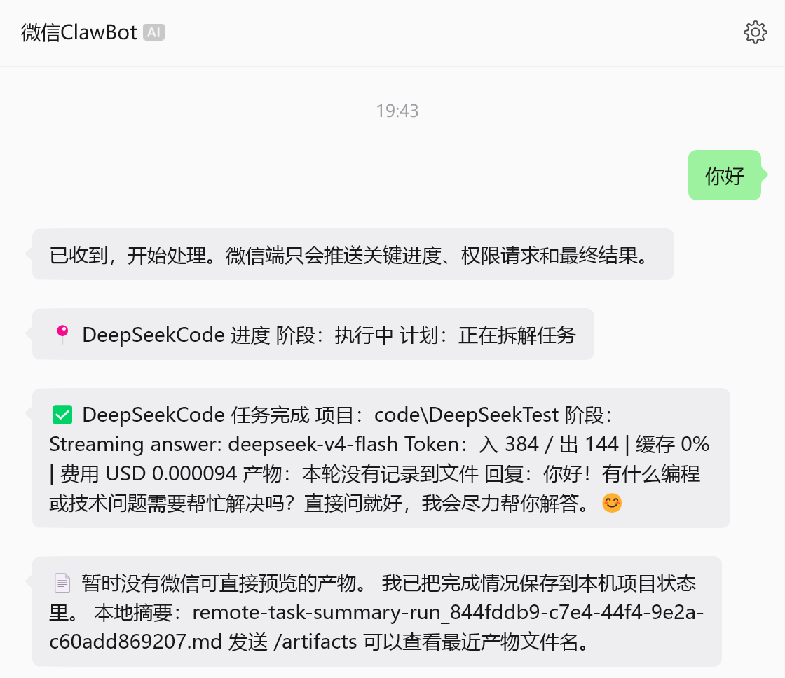
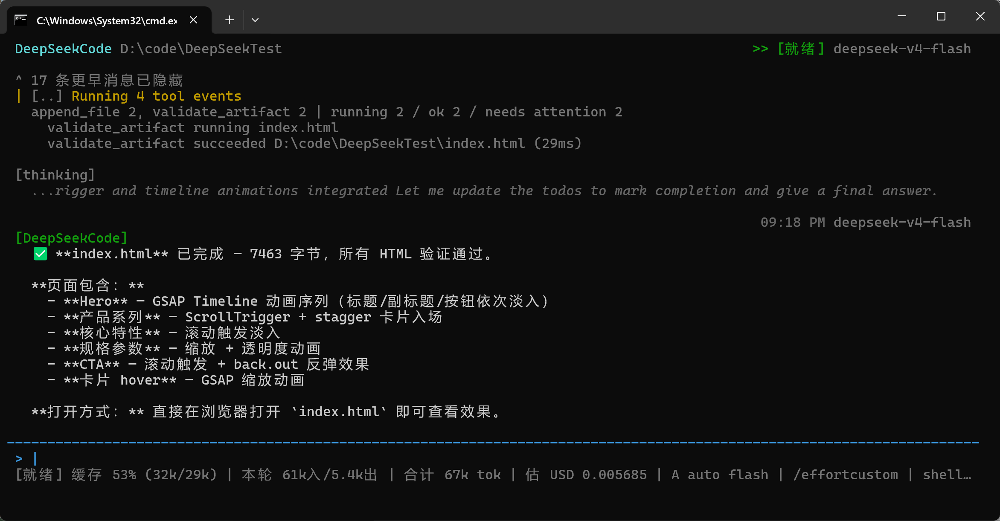

# DeepSeekCode

[English](./README.md) | [使用指南](./GUIDE.md) | [架构](./ARCHITECTURE.md) | [CLI](./CLI_REFERENCE.md) | [开发文档](./DEVELOPMENT.md) | [接口文档](./API_REFERENCE.md) | [官网](https://xh20010913-svg.github.io/DeepSeekCode/)

DeepSeekCode 是一个面向真实项目目录运行的本地通用 Agent runtime。它使用 DeepSeek native tool calling 驱动文件、shell、浏览器、skills、plugins、MCP、微信远程、多 agent 协作和任务验收。

v0.3.1 的重点是把“会调用工具”推进到“能围绕任务契约执行、验收、失败回放和自修复”。网页只是可验收产物的一类；同一套 `verify_task` 也用于代码项目、CLI 脚本、Office/PDF、表格、研究报告、数据任务、图片媒体、MCP、插件和自动化任务。

## 安装

```cmd
npm install -g @xh12312/deepseekcode --registry https://registry.npmjs.org/
cd /d D:\code\DeepSeekTest
deepseekcode --model deepseek-v4-flash
```

主命令是 `deepseekcode`。不提供 `deepseek` 别名，避免和其他工具冲突。

源码运行：

```cmd
git clone https://github.com/xh20010913-svg/DeepSeekCode.git
cd DeepSeekCode
npm install
npm run build
npm run start -- --project "D:\code\DeepSeekTest" --model deepseek-v4-flash
```

常用环境变量：

```env
DEEPSEEK_BASE_URL=https://api.deepseek.com
DEEPSEEK_API_KEY=your_deepseek_api_key
DEEPSEEK_MODEL=deepseek-v4-flash
DEEPSEEKCODE_LANGUAGE=zh-CN
```

## 真实运行截图

| 本机 TUI 同步微信输入/输出 | 个人微信远程结果 |
| --- | --- |
|  |  |

GSAP skill 自动参与网页动画任务，并完成入口文件验证：



## 核心能力

### Native tool loop

DeepSeekCode 要求 provider 支持 native function calling。模型只发 `tool_calls`；runtime 负责参数校验、权限 gate、工具执行、tool_result 摘要回放和失败反馈。不再依赖模型输出大块 JSON ActionEnvelope。

### 通用任务契约与验收

每个非聊天任务都围绕 `TaskCompletionContract` 执行：

- 目标：用户真正要完成什么。
- 预期产物：文件、目录、数据、文档、脚本、服务、图片或其他输出。
- 可验证行为：能运行、能打开、能生成结果、能通过检查。
- 完成标准：用户要求、角色验收、测试结果和限制条件。

`verify_task` 是统一验收入口。它会根据真实文件、package scripts、产物类型和任务合约选择检查方式：

- 代码项目：install/build/test/start、端口、依赖、启动 smoke check。
- CLI/脚本：执行命令、退出码、输出和生成文件。
- 网页/前端：浏览器打开、截图、空白页、控制台错误、资源缺失。
- DOCX/PPTX/XLSX/PDF：文件结构、可打开性、必要时预览。
- Markdown/报告：结构、关键章节、数据/引用完整性。
- 数据任务：CSV/XLSX/JSON/schema、统计结果、图表文件。
- 图片/媒体：格式、尺寸、可预览。
- MCP/插件/skill：安装、发现、调用、返回结果。

验收失败会作为 tool_result 回放给模型，下一轮必须修复后重新验收。

### Windows 工具可靠性

`run_command` 在 Windows 上使用 PowerShell。runtime 会在工具执行前识别常见 POSIX 命令不兼容问题，例如 `mkdir -p`、`cat`、`rm -rf`、bash here-doc，并返回可执行的 PowerShell 修复建议。对 `node-gyp`、Visual Studio 缺失、Node 版本不兼容、native dependency 失败、端口占用和依赖安装失败也会输出结构化诊断，避免反复无效重试。

### Skills / Plugins / MCP

DeepSeekCode 支持安装本地路径、GitHub repo/path、Git URL、`file://` Git 源的 skill/plugin。模型可通过 `search_skills` 与 `invoke_skill` 自动调用匹配技能，不要求用户每次都提示“用某个 skill”。

MCP 通过统一入口进入工具链路，结果走同一套权限、摘要、hook、prompt audit 和验收逻辑。当前 MCP 能力仍按“可测试/实验中”标注，避免把未接通能力写成已完成。

### 多 Agent

用户可以自然语言要求多 agent 协作。若用户指定角色，runtime 保留用户角色；若未指定，默认生成 Planner、Builder、Tester、Reviewer。Reviewer 的责任不是只看网页，而是按通用任务契约确认产物、行为、启动/运行、文档、数据或其他目标是否达成。

当前多 agent 是中心编排 + 共享黑板 + 可见状态的实现，仍在继续增强独立子 agent 执行深度。

多 Agent 工作流启动时，DeepSeekCode 会自动启动只读的 Pixel-compatible Agent Panel。TUI 模式会在本机浏览器打开一次；微信/企微远程模式会在配置了 `DEEPSEEKCODE_AGENT_PANEL_PUBLIC_BASE_URL` 的情况下发送带 30 分钟 view token 的安全链接。没有公网隧道时会降级为本机链接和状态摘要。

面板展示任务目标、当前阶段、是否卡住、最近工具、token/cache 概览；每个角色的职责、当前任务、已分配任务、完成证据、阻塞点、skills、tools、验收标准；任务板、协作时间线、产物入口、验证结论和 `agent-trace.jsonl`。备用命令：

```text
/agents dashboard
/agents dashboard share
/agents dashboard trace
/agents dashboard close
```

### 微信远程

支持两条远程路径：

- 企业微信 WeCom：实验中，可用于长连接机器人。
- 个人微信 OpenClaw：实验中，可用于扫码登录后的远程控制。

推荐在本机 TUI 中使用 `/remote-control` 绑定远程通道。微信端只显示简洁进度、权限请求、旁路问答和最终结果，不输出控制台日志或大段源码。

远程产物回传由 runtime 根据真实产物类型制定 `RemoteDeliveryPlan`：

- 网页或浏览器可见产物：优先发截图和入口摘要。
- Office/PDF：发微信可预览文件；可转图时补预览。
- Markdown/文本：发简短摘要，必要时再发文件。
- 多文件项目：发 manifest、入口、启动命令和关键预览，不刷屏源码。

## 常用命令

| 命令 | 用途 |
| --- | --- |
| `/doctor` | 检查 provider、native tool calling、路径、skills/plugins、缓存和权限 |
| `/tools` | 显示真实接入的工具 |
| `/model`、`/model flash`、`/model pro` | 切换模型 |
| `/language zh\|en` | 切换界面语言 |
| `/shell on`、`/shell off` | 切换 shell 权限 |
| `/skills`、`/skills install <source>` | 查看或安装 skills |
| `/plugins`、`/plugins install <source>` | 查看或安装 plugins |
| `/mcp` | 查看 MCP 状态 |
| `/remote-control` | 绑定微信/企微远程控制 |
| `/ask <问题>` | 长任务期间进行只读旁路问答 |
| `/status`、`/status full` | 查看任务状态 |
| `/cache report` | 查看缓存命中、动态上下文和优化建议 |

## 能力状态

| 能力 | 状态 | 说明 |
| --- | --- | --- |
| DeepSeek native tool calls | 已验证 | provider 层要求 tools 数组，不再静默降级到旧 JSON planner |
| 文件读写、patch、搜索 | 已验证 | 走 typed tool registry 和 Zod 参数校验 |
| Windows shell 诊断 | 已验证 | 识别 POSIX 命令和 native dependency 构建失败 |
| 通用 `verify_task` | 已验证 | 支持多类产物和 package/script 检查，仍在扩展更多专用 validator |
| Office/PDF/表格 | 部分可用 | DOCX/PPTX/XLSX/PDF 可校验，复杂版式预览仍在加强 |
| Skills/plugins | 部分可用 | 安装、搜索、调用可用，更多真实 skill 回归测试继续补 |
| MCP | 实验中 | mock 与统一入口可测试，真实服务矩阵仍在补 |
| 多 Agent | 实验中 | 可见 workflow 和 Reviewer 合约验收已接入，独立子 agent 深度执行继续增强 |
| 个人微信 OpenClaw | 实验中 | 可远程控制，网络恢复、二维码稳定性和图片预览仍需完善 |
| 企业微信 WeCom | 实验中 | 保留通道，依赖企微机器人配置 |
| computer_use | 保留 | 未作为默认能力宣传 |

## 测试与发布

基础检查：

```cmd
npm.cmd run typecheck
npm.cmd run build
npm.cmd pack --dry-run
```

真实任务测试只放在 `D:\code\DeepSeekTest`。测试产物、prompt audit、`.env`、node_modules 不进入 GitHub。

## 参考方向

DeepSeek Function Calling、DeepSeek Context Caching、Claude Code subagents/skills/hooks/MCP、MCP TypeScript SDK、Playwright screenshots、Pixel Agents、browser-use。
